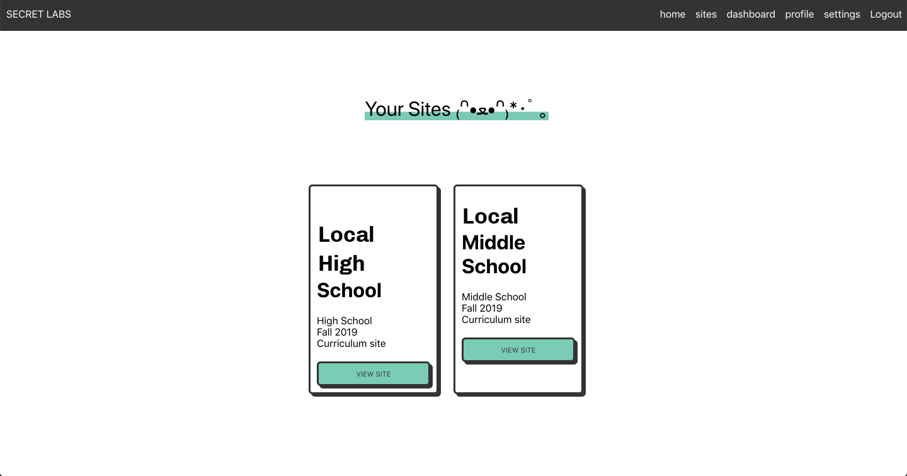

# 🧤Secret Labs

This application is an open sourced edTech platform

primarily serving as a refactor for ANova Labs and to support the mission statement of ANova
https://github.com/ANovaBerkeley/anovalabs

# Features
- Account creation + Log-in with Google oAuth 2.0
- Create/Edit/Delete School Sites
- Create/Delete School Site Times
- Create/Edit/Delete Lessons (which contain links for slides and exit tickets)
- Roster List for each site
- Role Based Access to Sites/Lessons
- Admin Dashboard for Execs to approve/deny Mentors/Mentees/Site Leaders for joining a Site and also approve/deny Role Request changes
- Role Request -- request to change role from mentor to Site Leader or Site Leader to Exec
- Profile Page -- allowing user to edit their details like preferred name or preferred pronouns

## System Requirements
- MongoDB db version: 4.0.4
- npm 6.9.0
- node 8.12.0

## 💻 How To Run Locally
- If you are running in an OSX environment you can run the following commands
- Go inside of /client folder and run `npm install` then `npm run start`
- Open a new tab in your terminal
- Then go into the root folder and run `npm install` then `npm run dev`
- Go to your browser at http://localhost:3000/
- You should now be able to log-in/sign-up for an account
- NOTE: If you are running the application for the first time -- you will need to go into the database and change your role to `EXEC` since the database is not seeded with a default admin -- this is important to note because if you don't have the `EXEC` role you will not be able to approve or deny any requests (including for yourself)

## Testing
- If you would like to run the test suite -- type `npm run test` in the root directory

## Models
SecretLabs has 4 primary collections and 2 junction tables (many-to-many relationships)

### Primary collections are:
- User
- Site
- SiteTime
- Lesson

### Junction Collections (many-to-many)
- Roster - this was specifically made to map out a user and their Site + Site Time -- making it very easy to make such queries like -- "Given a user's ID -- what sites are they currently part of? or Given a Site ID what users are currently part of that Site, ect."
- Request - this was specifically made to make it easy to request access to join a site or to request a role change

### Google Client Key
- You will see in the /client folder that there is a .env.development file and a .env.production file -- they currently have a google client -- it is may or may not be valid in the future -- so it is suggested to generate your own google client key
